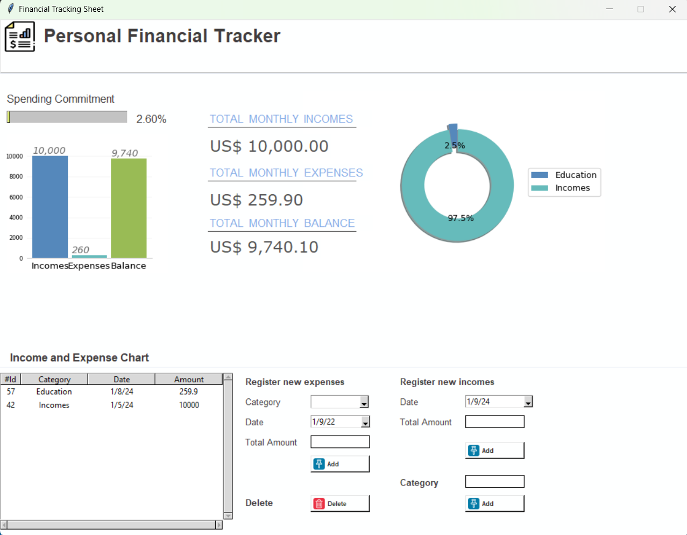

# Financial Tracking Sheet

## Overview

The Financial Tracking Sheet is a Python-based application designed for personal financial management. While still in its early stages, this tool covers essential functionalities for monthly financial monitoring.

The project is built using Python and incorporates several libraries:

- **Tkinter**: Used to create an intuitive and user-friendly graphical interface.
- **PIL**: Utilized for image handling and displaying icons.
- **Matplotlib**: Enables the generation of efficient graphs and charts for visualization.
- **SQLite**: Manages data storage, including categories, income, and expenses.

## Features

- **Expense and Income Tracking**: Users can record their expenses and incomes, categorize them, and monitor their financial flow.
- **Graphical Representation**: Visualizes financial data through graphs, providing insights into spending habits and income sources.
- **Interactive Interface**: Offers an interactive and intuitive interface for easy navigation and data input.
- **Database Management**: Stores and manages financial data using an SQLite database.

## Purpose

The primary goal of this application is to assist users in managing their finances effectively. Given the escalating debt levels among Brazilians, this tool aims to provide insights and controls to aid in financial planning.

## Future Improvements

Future enhancements planned for the application include:

- **Enhanced Feedback**: Offering comprehensive feedback on spending patterns and suggesting budget adjustments.
- **Investment Insights**: Providing investment suggestions based on historical financial behavior.
- **Alert System**: Issuing alerts when expenses reach predefined concerning levels.

## CRUD Functionality

This application implements the CRUD concept (Create, Read, Update, Delete) for financial data management. The SQLite database is utilized to enable the following operations:

- **Create:** Enables the addition of new categories, income, and expenses to the system.
- **Read:** Facilitates the visualization of all stored information, such as categories, recorded income, and expenses.
- **Update:** Allows for the modification of existing information, such as editing details of previously recorded categories, income, or expenses.
- **Delete:** Permits the removal of categories, income, or expenses from the system.

## How to Use

1. **Install Dependencies**: Ensure all necessary dependencies are installed using `requirements.txt`.
2. **Run the Application**: Execute the main script to launch the Financial Tracking Sheet.

## Contributing

Contributions, suggestions, and feedback are highly appreciated! If you'd like to contribute, feel free to make improvements and suggest changes.
